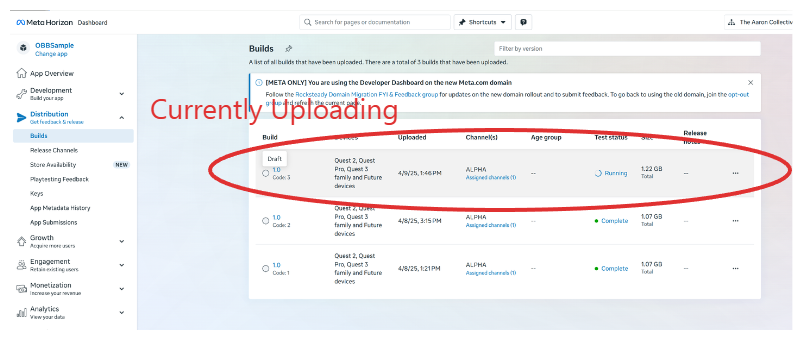
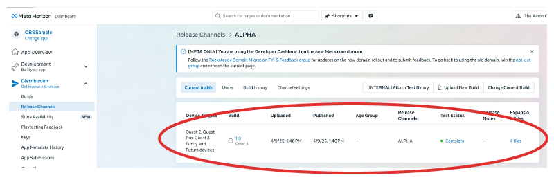
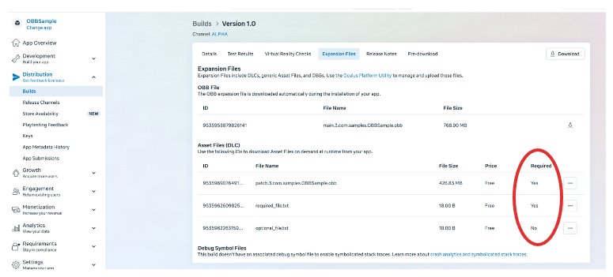

# Unreal-OBBSample

## Introduction

As your project gets bigger, you're going to need to break it up into pieces due to hard single-file size limits. You may also want to add DLC or other optional content. This sample project shows how to do that with Unreal Engine 5+.

The limits:

* APKs can be up to 1 GB
* OBBs can be up to 4 GB
* we support 1x OBB as the "OBB" file (the upload tool takes this as an option)
* after that we support unlimited number of additional OBBs

This project:

* Provides guidelines for handling large projects on Quest in UE5+.
* It shows how one can automatically break a 1GB+ project into multiple obb files and
* How to upload those to a release channel so people can install them to their headset.
* This sample is about packaging your data into OBBs, and uploading those OBBs to the Meta Horizon backend

---

## How Unreal Works With Assets

### Chunks and Paks/(Ucas and Utoc) files

* In Unreal, assets in your project are organized into chunks. Each chunk has a numeric id, and every project gets Chunk "0" by default.
* Chunks are assigned in a variety of ways, including via the Asset Manager, asset labels in the editor, or via rules in your *.ini files.
* When packaging, every chunk is packaged into a file. Which is just a proprietary compressed file format. These go into the Saved/.../Content/Paks directory. (e.g. Saved/StagedBuilds/Android_ASTC/OBBSample/Content/Paks)
  * Unreal 4: used .pak files by default.
  * Unreal 5: with IoStore enabled, Unreal generates .ucas and .utoc files by default (.ucas is the actual compressed data, .utoc is a table of contents file that tells the engine where to find the data in)

See the [Unreal docs on Chunks](https://dev.epicgames.com/documentation/en-us/unreal-engine/cooking-content-and-creating-chunks-in-unreal-engine?application_version=5.5)

By default, all assets go in Chunk 0.

### APKs and OBBs

 Unreal will package your project into an apk and a single OBB file by default, and will add more OBB files as your project grows.

#### APKs

The APK is the main executable file for your game. It contains the game's code. The APK is the only file that is required to run your game and optionally you can instruct Unreal to package assets into it if size permits.

#### OBBs

OBBs are an android-ism. They are just zip files that contain assets. In Unreal the required OBBs are mounted and read automatically at startup.

As your project grows, Unreal will automatically split your assets into multiple OBB files.

You can also use the Chunk system to create DLC or optional content. You can create a new Chunk, add assets to it, and then package it as a separate OBB file. You can then upload the OBB file to your release channel.

This project shows makes 2 chunks, Chunk 100 and Chunk 200, and packages them as required, into multiple OBB files.

### Full Example

* Chunks: In this project three chunks are created, Chunk 0 (implicit) Chunk 100 and Chunk 200 (note: these numbers were picked arbitrarily to show the concept, you can use any number you want).
* Pak files: In this project three groups of files are created, one for each chunk. in Saved/StagedBuilds/Android_ASTC/OBBSample/Content/Paks/ with various implementation-specific extensions (.pak, .ucas, .utoc etc. depending on your project settings)
  * pakchunk0-Android_ASTC
  * pakchunk100-Android_ASTC
  * pakchunk200-Android_ASTC
* OBB files: the pak files are then packaged into OBB files, usually multiple paks per obb.
  * In this project they live are built to the Shipping/Android_ASTC project directory, and are named:
    * main.%STORE_VERSION%.%PACKAGE_NAME%.obb : e.g. main.1.com.samples.obbsample.obb
    * patch.%STORE_VERSION%.%PACKAGE_NAME%.obb : e.g. patch.1.com.samples.obbsample.obb
  * Note: open these with any zip tool to see the contents. For me the main file was chunk 100 + some chunk 200 files, and the patch file was entirely chunk 200.
* APK file: also in the Shipping/Android_ASTC project directory
  * AFS_OBBSample-Android-Shipping-arm64.apk

---

## Overview of Asset Distribution Methods

When you upload files with your apk, you can choose to upload them as required or optional files:

* **Required files:** are downloaded and installed automatically when the app is installed.
* **Optional files:** are not downloaded and installed automatically. Instead you signal for the downloader to download them when the user is ready to use them.

This project demonstrates both methods in the Shipping/config-file.json file.

---

## Using This Sample

This sample is set up to create multiple OBB files as part of packaging to demonstrate how to upload these to a release channel.

### Getting Started

To use this project for yourself, make a few changes:

1. Make an App
   1. Go to <https://developers.meta.com/horizon/manage>.
   2. Select 'Create a New App' and follow the instructions.
   3. get the App ID and App Secret from the app's Development > API section.
2. Modify `config.bat` - this contains the various things necessary to setup, package, and upload the project.
   1. set `MY_APP_ID=` and `MY_APP_SECRET=` the values from step 1.
   2. set other variables to match your setup.
   3. download and set the paths to the required tools and Unreal.
3. From the project directory run `setup.bat` - this will create some large files to generate multiple OBB files and add them to the project.
   1. Note: running unreal the first time may spend a long time compiling shaders. This is normal. However you can kill and safely re-run this script if it hangs.

### Iterating with the Sample

1. Build the shipping assets:
   1. From the project directory run `package_project_for_upload.bat`
   2. or manually:
       1. In Project Settings > Plaforms > Android > Store Version: Update the version to the next monotonically ascending value.
       2. Select Platforms > Android > Package Content.
       3. Choose 'OBBSample\shipping' as the output folder and click okay (or whatever folder you set MY_SHIPPING_DIR to in `upload_package.bat`).
2. Upload the build.
   1. From the project directory run `upload_package.bat`, which should take care of things. Note this can take a while due to the size of this demo.
3. On your app's dev site page (developers.meta.com/horizon/manage/applications/<the app you made in step 2>), you can see the uploaded build under:
   1. Distribution > Builds.
   2. Distribution > Release Channels > Alpha (or whichever channel you targeted).
4. On your headset:
   1. Make sure to add yourself to the Alpha channel on the dev site.
   2. You should see OBBSample under your library as downloadable.
   3. Download it and launch.

### More Details on the Uploaded Build

1. You can see it under Distribution > Builds:
   * 
2. Distribution > Release Channels > Alpha
   * 
3. Alpha Channel File Info: here you can see the required and optional files we uploaded.
   * 

---

## References and Further Reading

* **Setup and app signing**
  * [Unreal Setup: Signing your app](https://developers.meta.com/horizon/documentation/unreal/ps-setup/#unreal-engine-specific-settings)
  * [Android Application Signing](https://developers.meta.com/horizon/resources/publish-mobile-app-signing)
  * [Unreal Docs: Signing for Release](https://dev.epicgames.com/documentation/en-us/unreal-engine/signing-android-projects-for-release-on-the-google-play-store-with-unreal-engine)
  * [How To Remove Permissions in Unreal Projects](https://developers.meta.com/horizon/resources/permissions-remove)

* **Meta Documentation – Asset Files**
  * [Managing Asset Files in Unreal](https://developers.meta.com/horizon/documentation/unreal/ps-assets) - Explains official steps to incorporate large files, OBB expansions, required assets, etc.
  * [Add-ons Integration](https://developers.meta.com/horizon/documentation/unreal/ps-iap) - How to download optional content at runtime.

* **Meta Quest Virtual Reality Checks (VRC)**
  * [VRC.Quest.Packaging.5 & VRC.Quest.Packaging.6 (Packaging Requirements)](https://developer.oculus.com/resources/vrc-quest-packaging/) - This page details the packaging limitations, APK/OBB size constraints, and how to meet them.

* **Unreal Engine Documentation – Packaging for Android**
  * [Packaging Android Projects (UE Docs)](https://docs.unrealengine.com/5.0/en-US/android-development-in-unreal-engine/)
  * Covers relevant project settings, including OBB/pak usage.

* **Unreal Engine Pak File Runtime Loading Tutorial**
  * [Official Epic Docs on Paks](https://docs.unrealengine.com/5.0/en-US/pak-file-utilities-in-unreal-engine/)
  * Shows how to mount/unmount .pak files at runtime.

* **Oculus/Meta Developer Blog on UE4 Memory and Load Times**
  * [Reducing Load Times in UE4 VR Projects](https://developer.oculus.com/blog/?query=load%20times%20UE4)
  * Though older, the guidelines still apply to UE5 for memory/asset streaming best practices.

---

# License
The [Meta License](./LICENSE) applies to the SDK and supporting material. The MIT License applies to only certain, clearly marked documents. If an individual file does not indicate which license it is subject to, then the Meta License applies.
